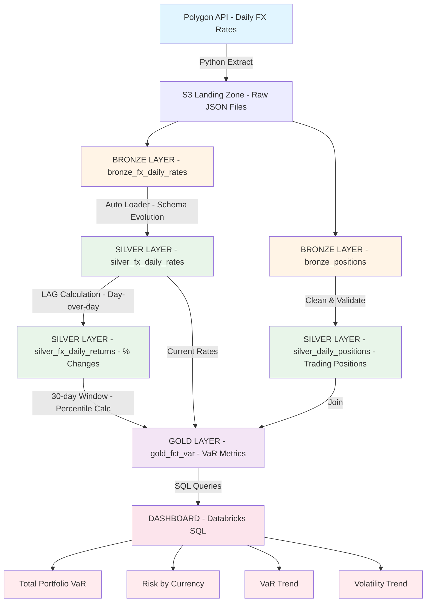

# FX Market Risk Analytics Pipeline

> Automated Value-at-Risk (VaR) calculation system for foreign exchange portfolios using Databricks Delta Live Tables and historical simulation methodology.

## 🎯 Business Problem

This pipeline answers critical questions for FX trading desk risk managers:

- **How much could we lose tomorrow?** (1-Day VaR at 95% confidence)
- **Which currency pairs carry the most risk?** (Risk concentration analysis)
- **Is our portfolio getting riskier?** (Trend analysis over time)
- **How would a 1% market shock impact us?** (Stress testing)

## 🏗️ Architecture


**Technology Stack:**
- **Data Platform:** Databricks (Delta Lake, Delta Live Tables)
- **Orchestration:** DLT scheduled pipelines (23:00 UTC daily)
- **Data Source:** Polygon.io Free Forex API
- **Language:** SQL (DLT pipeline & Dashboard datasets), Python (data generation & extraction)
- **Storage:** Delta tables

## 📊 Methodology

**Value at Risk (VaR) Calculation:**
- **Method:** Historical Simulation
- **Confidence Level:** 95% (5th percentile for long positions, 95th for short)
- **Time Horizon:** 1-day
- **Lookback Period:** 30 trading days (rolling window)

**Formula:**
```
VaR(95%) = Position Size × |5th Percentile of Daily Returns|
```

**Example:**
- Position: Long €10M in EUR/USD
- 30-day returns: 5th percentile = -2.1%
- VaR = €10M × 2.1% × 1.0950 (current rate) = **$230,025 USD**

## 🚀 Current Implementation

### ✅ Delivered

**Data Pipeline:**
- [x] Bronze → Silver → Gold medallion architecture (DLT)
- [x] Incremental processing with historical preservation
- [x] Automated daily execution (scheduled at 23:00 UTC)
- [x] Schema inference and evolution handling
- [x] Multi-currency support (5 major FX pairs)

**Analytics Engine:**
- [x] Historical VaR calculation (30-day rolling window)
- [x] Volatility metrics (30-day standard deviation)
- [x] Position-weighted USD aggregation
- [x] Stress scenario modeling (1% adverse move)
- [x] Backfilled historical data (Jan 2025 - present)

**Visualization:**
- [x] Interactive dashboard (3 key metrics + 3 charts)
- [x] Contextual descriptions for decision-making
- [x] Risk concentration breakdown
- [x] Trend analysis (VaR and volatility over time)

### 🔄 Next Steps

**Phase 2: Production Hardening**
- [ ] Job as Code configuration (YAML-driven)
- [ ] Comprehensive testing framework (unit + integration)
- [ ] Airflow orchestration layer
- [ ] Data quality expectations (DLT constraints)
- [ ] Error handling and retry logic
- [ ] CI/CD pipeline (GitHub Actions)


## 🔗 Quick Links

- **Dashboard**(pdf as public sharing is not available yet in my Databricks Workspace): [View Dashboard PDF](#) *(https://drive.google.com/file/d/138t1xom5uULCKo_tuilLKkDlfcPnq_Ab/view?usp=sharing)*

## 🎓 Key Technical Decisions

1. **Self-join pattern** as percentile_cont() aggregrate function with windowing are not currently available in Databricks, despite the documentation
3. **Separate percentiles for long/short** (5th for long, 95th for short positions)
4. **Trading day awareness** (FX market operates 24/5, includes Sunday evening data)
5. **USD normalization** handles mixed currency pair conventions (EUR/USD vs USD/JPY)

## 👤 Author

**Guido Tognini**
- LinkedIn: [https://www.linkedin.com/in/guidotognini/](#)
- GitHub: [github.com/guidotognini](#)
